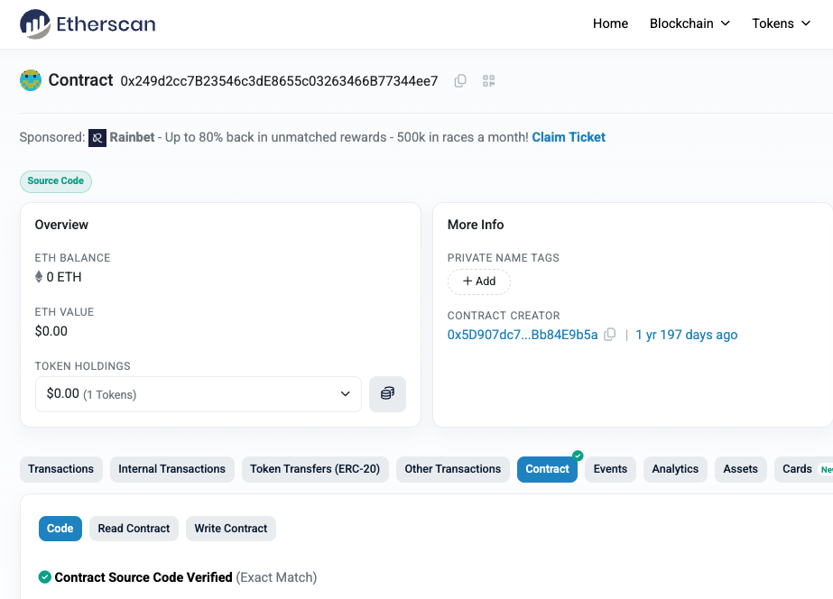
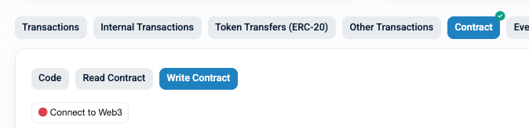
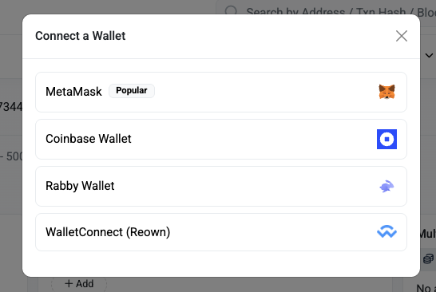
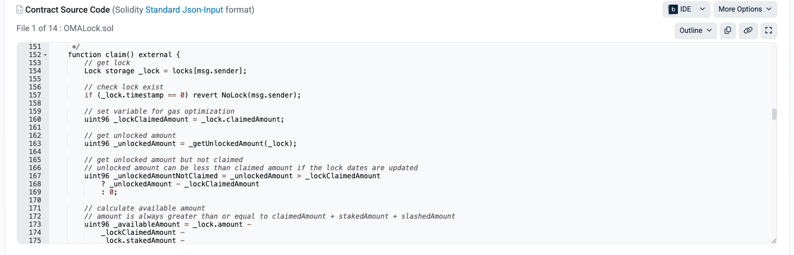
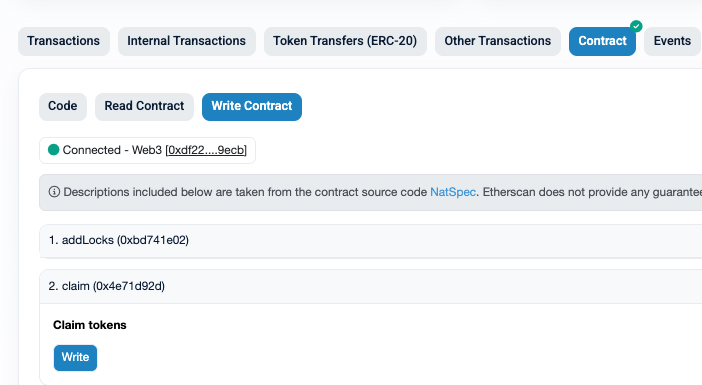

# How to Claim OMA Tokens (No Frontend Required)

> **IMPORTANT: Do not claim OMA tokens before OMchain mainnet is live.** Claiming before mainnet launch violates OMA3 policy due to Swiss regulatory restrictions and could result in slashing of your remaining locked tokens. Only OMA3 members that are compliant with the [Builder Program](https://docs.google.com/document/d/1yvFK_VO-2iHJrKAw8VeTvt2y8bgjlEGyT7YPW3R6Im4/) are eligible to claim tokens once mainnet is live.

This guide explains how to claim vested OMA tokens directly from the OMALock contract. No frontend or custom application is needed. All interactions happen through Etherscan or Safe.

## Before You Start

- Your wallet must have an existing lock in the OMALock contract.
- Some portion of your tokens must be past the cliff date and vested (unlocked).
- You need a small amount of ETH in your wallet to pay gas fees.

## Contract Address

OMALock (Ethereum Mainnet): [`0x249d2cc7B23546c3dE8655c03263466B77344ee7`](https://etherscan.io/address/0x249d2cc7B23546c3dE8655c03263466B77344ee7#writeContract)

- Claiming tokens requires calling the `claim()` function of the above contract.  The function takes no parameters and sends all currently claimable tokens to the wallet that calls it, provided the wallet has an existing lock in the contract.
- A hardware wallet (Ledger, Trezor, etc.) or a multisig wallet (SAFE.global, etc.) is strongly recommended. If you used a browser-only wallet (e.g. MetaMask without hardware), see the note at the end of this document.

---

## Verifying the Contract Before You Claim

Before calling any function on any smart contract, you should understand what it does. The OMALock contract is verified on Etherscan, which means the full Solidity source code is publicly readable. You can verify the `claim()` function yourself before executing it:

1. Go to the OMALock contract on Etherscan:
   https://etherscan.io/address/0x249d2cc7B23546c3dE8655c03263466B77344ee7#code

2. Click the "Code" tab. You will see the verified Solidity source code.



3. Find the `claim()` function in the source code.

4. If you read Solidity, review the function directly. If you do not, copy the `claim()` function source code and paste it into any LLM (ChatGPT, Claude, Gemini, etc.) with the question: "Does this function access, approve, or transfer any assets other than the OMA token? Can it affect any other tokens or assets in my wallet?"

5. Confirm you are comfortable with what the function does before proceeding to claim.

---

## Option A — Claiming with a Hardware Wallet

This method uses Etherscan's "Write Contract" interface with a hardware wallet (Ledger, Trezor) connected through MetaMask or a similar browser extension.

### Prerequisites

- Hardware wallet connected to MetaMask (via USB or Bluetooth).
- Ethereum app installed and open on the hardware wallet.
- Blind signing may need to be enabled in the Ethereum app settings if the transaction cannot be fully decoded on the device screen.

### Steps

1. Go to the OMALock contract "Write Contract" tab on Etherscan:
   https://etherscan.io/address/0x249d2cc7B23546c3dE8655c03263466B77344ee7#writeContract

2. Click "Connect to Web3" and connect your wallet.
   - Select MetaMask (or your preferred browser extension).
   - Make sure you are connected with the wallet that has the lock.
   - Make sure your wallet is on Ethereum Mainnet.





3. Find the `claim` function in the list. It takes no parameters.



4. Click "Write".



5. Your browser extension will route the signing request to your hardware wallet. Review the transaction on your device screen:
   - The "To" address should be the OMALock contract: `0x249d2cc7B23546c3dE8655c03263466B77344ee7`.
   - The value should be `0` ETH.
   - MetaMask will show a data field of `0x4e71d92d` — this is the `claim()` function selector and is the same for every OMALock deployment on any network.
   - What your Ledger displays depends on the model:
     - Nano S / Nano X (blind signing): limited display — typically shows the transaction hash. Verify the "To" address if shown.
     - Flex / Stax: shows the "To" address, value (0 ETH), and gas. Calldata appears as raw hex.

6. Approve the transaction on your hardware wallet.

7. Wait for the transaction to be mined and finalized. You can track it on Etherscan by clicking the transaction hash.

8. Verify the transaction succeeded on Etherscan. The transaction status should show "Success" and the "Tokens Transferred" section should show OMA tokens transferred to your wallet.

9. Your claimed OMA tokens will appear in your wallet. You may need to add the OMA token to your wallet's token list using the token address: `0x36a72D42468eAffd5990Ddbd5056A0eC615B0bd4`.

### Enabling Blind Signing (Nano S / Nano X)

The Nano S and Nano X cannot decode contract calls on-screen. They require "blind signing" to be enabled for any contract interaction, including `claim()`.

1. On your device, open the Ethereum app.
2. Go to Settings.
3. Enable "Blind signing".
4. Retry the transaction.

Blind signing means the hardware wallet cannot fully decode the contract call on its screen. This is normal for the Nano S and Nano X. Always verify the contract address in MetaMask before approving on the device.

The Ledger Flex and Stax do not require blind signing for basic contract calls — they display the "To" address and value (0 ETH) directly on screen.

---

## Option B — Claiming via Safe (Multisig Wallets)

If your locked tokens are held by a Safe (Gnosis Safe) multisig wallet, use the Safe Transaction Builder. This flow does not depend on Etherscan or any third-party site — only the Safe UI and the ABI provided in this document.

### Steps

1. Go to https://app.safe.global and connect with your Safe.

2. Make sure you are on Ethereum Mainnet.

3. Click "New Transaction" then "Transaction Builder".

<!-- Screenshot: docs/screenshots/safe-new-transaction.png -->

4. In the Transaction Builder:
   - Enter the OMALock contract address: `0x249d2cc7B23546c3dE8655c03263466B77344ee7`
   - Paste the following ABI for the claim function:
     ```json
     [{"inputs":[],"name":"claim","outputs":[],"stateMutability":"nonpayable","type":"function"}]
     ```
   - Select the `claim` function from the dropdown.
   - ETH value: `0`.

<!-- Screenshot: docs/screenshots/safe-transaction-builder.png -->

5. Click "Add transaction", then "Create Batch".

6. Review the transaction details in the Safe UI:
   - To: `0x249d2cc7B23546c3dE8655c03263466B77344ee7`
   - Value: 0
   - Function: `claim()`
   - Data: `0x4e71d92d` (the `claim()` function selector)
   - Verify the contract address matches the OMALock address listed in this document.

<!-- Screenshot: docs/screenshots/safe-review-transaction.png -->

7. Submit the transaction for signing.

8. Other Safe signers must review and approve the transaction following the verification steps in the "Reviewing a Safe Transaction" section below.

9. Once the threshold is met, any signer can execute the transaction.

<!-- Screenshot: docs/screenshots/safe-awaiting-signatures.png -->

10. After execution, confirm the transaction succeeded by checking the transaction hash on Etherscan. The transaction status should show "Success" and the "Tokens Transferred" section should show OMA tokens transferred to your Safe.

<!-- Screenshot: docs/screenshots/safe-transaction-confirmed.png -->

### Reviewing a Safe Transaction (For Signers)

Before signing any Safe transaction, each signer must independently verify the following. Do not rely on another signer's confirmation — verify it yourself.

1. Open the pending transaction in the Safe UI at https://app.safe.global.

2. Verify the "To" address is exactly `0x249d2cc7B23546c3dE8655c03263466B77344ee7`. Compare character by character against this document. A single character difference means you are interacting with a different contract.

3. Verify the "Value" is `0` (no ETH is being sent).

4. Verify the "Data" field shows `0x4e71d92d`. This is the `claim()` function selector. If the data field shows anything longer or different, the transaction is not a simple `claim()` call — do not sign it.

5. Verify you are on Ethereum Mainnet (chain ID 1) in the Safe UI.

6. If you have access to a terminal, you can independently verify the function selector:
   ```bash
   # Using the oma3-ops hash utility:
   hash 0x4e71d92d
   # Or using cast (from Foundry):
   cast sig "claim()"
   ```
   Both should confirm `0x4e71d92d` corresponds to `claim()`.

7. Check that the transaction was created by an expected Safe owner. If the transaction appeared unexpectedly or was proposed by an unknown address, do not sign it.

8. At least one signer should verify using the Safe mobile app in addition to the web UI. This provides an independent verification path in case the web UI is compromised.

Only sign after completing all checks above.

---

## Troubleshooting

### "NothingToClaim" error

This means either:
- Your tokens have not reached the cliff date yet (vesting has not started).
- You have already claimed all currently vested tokens.
- Your remaining tokens are staked and not available for claiming.

Check your lock status using the instructions in the "Checking Your Lock Status" section below.

### "NoLock" error

Your connected wallet does not have a lock in the OMALock contract. Verify you are connected with the correct wallet address.

### Transaction succeeds but no tokens appear

Add the OMA token to your wallet's token list:
- Token address: `0x36a72D42468eAffd5990Ddbd5056A0eC615B0bd4`
- Symbol: OMA
- Decimals: 18

### Gas fees

Claiming requires a small amount of ETH for gas. If your wallet has no ETH, you will need to transfer some ETH to it before claiming.

---

## Is It Safe to Claim from a Wallet Holding Other Assets?

Calling any smart contract function is a trust decision. A malicious contract could request token approvals, call other contracts, or behave unpredictably.

The OMALock contract is verified on Etherscan and self-verifiable. The "Verifying the Contract Before You Claim" section above walks you through reading the source code — either directly if you know Solidity, or by pasting it into an LLM. The `claim()` function takes no parameters, sets no approvals, and only transfers vested OMA to the calling wallet. It cannot access any other asset.

If you have verified the contract source and are comfortable with it, there is no reason to move other assets out of your wallet before claiming.

If you want to be very cautious, ensure there are no significant other assets in the wallet before executing the claim function. This limits your exposure in case you interact with the wrong contract by mistake (e.g. via a phishing site).

### What to Watch Out For

- Phishing sites that impersonate Etherscan or Safe and trick you into signing against a different contract. Type website addresses (e.g. etherscan.io, app.safe.global) directly into your browser — do not click links from emails or messages. Bookmark the contract page.
- Blind signing a transaction without verifying the "To" address matches the OMALock contract. Always verify the contract address on the signing wallet (hardware wallet screen or Safe UI) on every transaction.
- Compromised browser extensions that modify transaction data before signing.
- Never share your private key or seed phrase with anyone.
- Never click links claiming to be an "OMA claim portal" — there is no official frontend.
- If you are using a browser-only wallet (MetaMask without a hardware wallet), transfer your claimed OMA tokens to a hardware wallet or a more secure wallet as soon as possible after claiming.

The OMALock mainnet address is `0x249d2cc7B23546c3dE8655c03263466B77344ee7`. Verify this address every time.

---

## Checking Your Lock Status (Optional)

You can check your lock details to see how much is vested and claimable.

1. Go to the OMALock contract on Etherscan:
   https://etherscan.io/address/0x249d2cc7B23546c3dE8655c03263466B77344ee7#readContract
2. Click the "Read Contract" tab.
3. Find the `getLock` function.
4. Enter your wallet address and click "Query".
5. The result shows:
   - `amount` — total locked tokens (in wei)
   - `claimedAmount` — tokens already claimed
   - `cliffDate` — when vesting begins (Unix timestamp)
   - `lockEndDate` — when 100% is vested (Unix timestamp)
   - `unlockedAmount` — how much has vested so far

To convert wei to OMA, divide by `1000000000000000000` (10^18). For example, `1000000000000000000` wei = `1.0` OMA.

To convert Unix timestamps to human-readable dates, use a converter such as https://www.unixtimestamp.com/.

Alternatively, if you have the `oma3-ops` CLI tools installed, you can run:

```bash
lock-status --network mainnet --wallet <your-address>
```

<!-- Screenshot: docs/screenshots/read-contract-getlock.png -->
